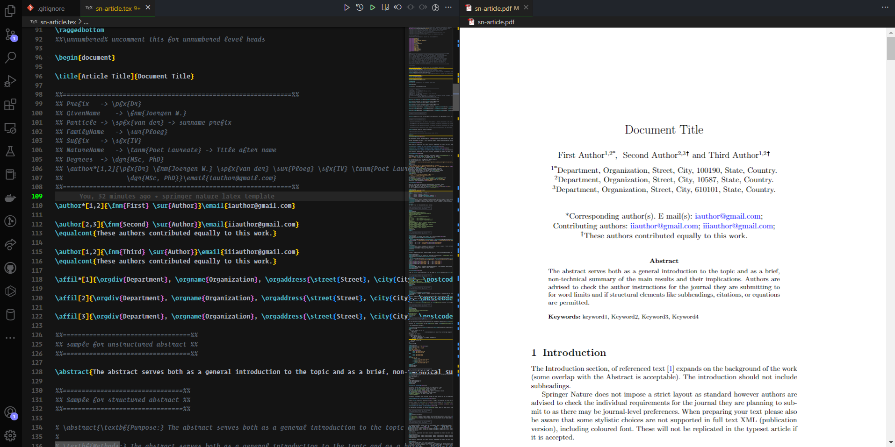

  

# springer-nature-latex-template

Springer Nature LaTeX is a set of LaTeX templates and style files that can be used to prepare journal article and book submissions to Springer Nature journals and books. The templates are designed to be easy to use and to follow Springer Nature's editorial policy guidelines.

The Springer Nature LaTeX template takes a "content first" approach with minimal formatting. This means that authors can focus on writing their manuscript without having to worry about the specific formatting requirements of the journal. The template also includes options to help authors meet journal-level requirements, such as the use of specific heading styles and the inclusion of figures and tables.

To use the Springer Nature LaTeX template, authors simply need to download the template files and replace the content of the template with their own manuscript. The template files can be compiled using a LaTeX compiler to produce a PDF of the manuscript.

The Springer Nature LaTeX template is available for free download from the Springer Nature website. It can be used to prepare submissions to any Springer Nature journal or book, including Springer, Nature Portfolio, and BMC journals.

### [>>> Springer Nature LaTeX Template](https://www.overleaf.com/latex/templates/springer-nature-latex-template/myxmhdsbzkyd)

## Springer Nature LaTeX in VS Code

### Requirements

- [MikTeX](https://miktex.org/download)
- [Perl](https://www.perl.org/get.html)
- [LaTeX Workshop Extension](https://marketplace.visualstudio.com/items?itemName=James-Yu.latex-workshop)
